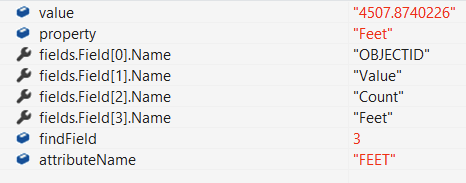

# 02046166

- The field I request is `VALUE` and is shown in the `attributeName` variable
- The `findIndex` is `1`
- The `item.GetPropAndValue` uses the `findIndex` of `1` and `property` is set to `OBJECTID` :bug:

- The field I request is `OBJECTID` and is shown in the `attributeName` variable -
- The `findIndex` is `0`
- The `item.GetPropAndValue` uses the `findIndex` of `0` and `property` is set to `Pixel value` :bug:

- The field I request is `FEET` and is shown in the `attributeName` variable - -
- The `findIndex` is `3`
- The `item.GetPropAndValue` uses the `findIndex` of `3` and `property` is set to `FEET` :white_check_mark:
